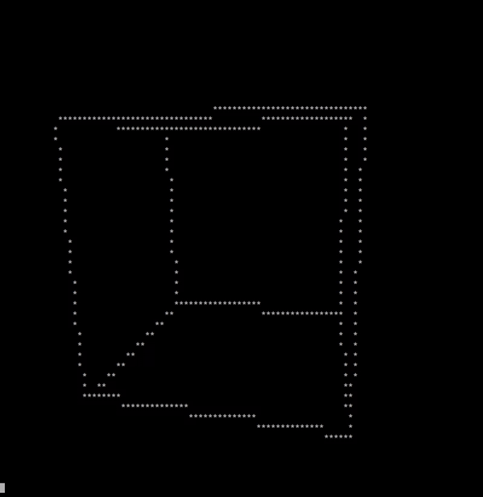
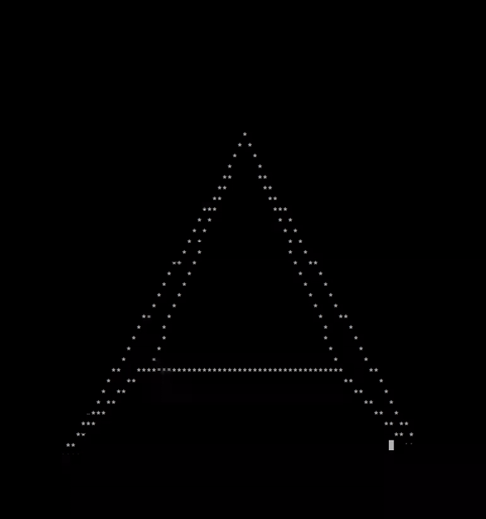

# CLI Wireframe Renderer

## Table of contents

1. [Overview](#overview)
2. [Usage](#usage)
    1. [Launching](#launching)
    2. [Functionality](#functionality)
3. [Configuration](#configuration)
    1. [Display config](#display-config)
    2. [Scene config](#scene-config)
4. [Structure](#structure)
5. [Math](#math)


## Overview



<i>CLI Wireframe Renderer</i> is a program which simulates a 3D space, projects it onto a 2D screen and renders it as a wireframe on your terminal.

It provides a programming interface for spatial transformations of objects (like translation and rotation) and rendering them using techniques like perspective projection and Bresenham's line algorithm.

The attached demo includes a simple, multi-threaded loop for getting user input, performing the simulation and rendering.


## Usage

### Launching

If you installed Rust with the methods provided on their webpage you should have access to `cargo`. If not please refer to instructions on the [Rust website](https://doc.rust-lang.org/book/ch01-01-installation.html).

Assuming you have everything up and working, launching the program is as simple as entering the program directory and executing:

```
cargo run
```

This command should automatically take care of all the dependencies, build and run the program.

### Functionality

The program, besides projecting and rendering the 3D space in your terminal, allows for basic camera movement.

You can control your camera and the program using:



Key | Action 
--- | ---
W   | Move Forward
S   | Move Backward
A   | Move Left
D   | Move Right
Q   | Move Up
E   | Move Down
Up  | Rotate Up
Down| Rotate Down
Left| Rotate Left
Right| Rotate Right
Esc | Quit

From the programmer's interface you can also create, move and rotate shapes, however as a user this is only available from the [config](#scene-config).


## Configuration

Configuration files reside in `config/` and there are two of them.

### Display config

`display.json` contains default camera and display configs. Here is an example:

```json
{
    "camera": {
        "position": {
            "x": 0.0,
            "y": 0.0,
            "z": -6.0
        },
        "rotation": {
            "x": 0.0,
            "y": 0.0,
            "z": 0.0
        },
        "focal_length": 1.0,
        "vertical_fov": 60.0,
        "aspect_ratio": 1.0
    },
    "terminal_display": {
        "width": 96,
        "height": 48,
        "frame_time_millis": 10,
        "edge_char": "*"
    }
}
```

All of the fields shown in the example are required.

#### Camera

The `camera` field allows setting the default properties of the camera, which are the `position` and `rotation`. These will be the starting values upon launching the program.

It also provides `focal_length`, `vertical_fov` (degrees) and `aspect_ratio`, which are fixed for the entire duration of the program and cannot be changed during execution.

In order for the display to look correctly the aspect ratio should be set to `1`.

#### Terminal Display

Inside `terminal_display` you also have a few configuration settings:

`width` and `height` are the display's dimensions in characters.

`frame_time_millis` is the target duration of each frame. For example setting it to `16` would be ~60 FPS.

`edge_char` is the character which will be used to draw the wireframes.

### Scene config

`shapes.json` contains configuration for shapes present in the scene. It is a list of shapes, all of which are defined by:

```json
[
    // first shape
    {
        "points": [
            {
                "x": 0.0,
                "y": 0.0,
                "z": 0.0
            },
            // and so on
        ],
        "edges": [
            {
                "start": 0,
                "end": 1
            },
            // and so on
        ],
        "origin": {
            "x": 0.0,
            "y": 0.0,
            "z": 0.0
        },
        "velocity": {
            "x": 0.0,
            "y": 0.0,
            "z": 0.0
        },
        "rotation_velocity": {
            "x": 0.0,
            "y": 0.0,
            "z": 0.0
        }
    },
    // any other shapes would go here
]
```

`points` is a list of positions for all points of the shape. 

`edges` tells the program which points should be connected with each other. In the above example the point with index `0` will be connected to the point with index `1`.

`origin` is the position of the origin of the object.

`velocity` is the speed with which the object will move per frame (later multiplied by delta time) permanently during the runtime of the program.

`rotation_velocity` is the speed with which the object will rotate per frame (later multiplied by delta time) during the runtime of the program.


## Structure

The files and structures of this project can be divided into three sections:

### Data

- `vector3f.rs` - A simple data structre which represents a 3D vector. Allows for basic algebraic operations like addition, negation, multiplication.

- `shape.rs` - A structure which defines an object in 3D space. It's a group of points, connected by edges, with an origin.


### Projection and Rendering

- `camera.rs` - Implements calculations needed for perspective projection.

- `terminal_display.rs` - Handles converting camera coordinates into pixels (or characters to be exact) on the screen and drawing wireframes (using Bresenham's line algorithm).

### Interactions

- `main.rs` - The glue which combines all the above classes to form a usable demo. Uses two threads - one for user input, the other for rendering.


## Math

This project implements [one-point perspective projection](https://en.wikipedia.org/wiki/3D_projection#Perspective_projection). The exact formulas used can be found [here](https://www.desmos.com/3d/dmadjz1qnw).